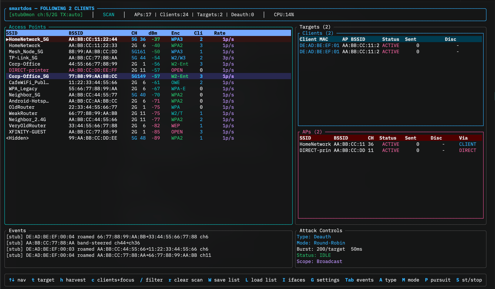

# smartdos v0.1



> **🚧 Work in Progress** — This project is under active development and has not been rigorously tested. Expect bugs, incomplete features, and breaking changes. Use at your own risk.

**Wireless AP scanner + deauth attack orchestrator with terminal UI**

`smartdos` is an interactive TUI tool for ethical wireless penetration testing. It discovers nearby access points via beacon frame capture, lets you select targets, and orchestrates deauthentication attacks in round-robin or parallel mode — all from a keyboard-driven terminal interface.

---

## ⚠️ LEGAL & ETHICAL DISCLAIMER

**This tool is for authorized security testing and educational purposes ONLY.**

- Only use this software on networks you **own** or have **explicit written permission** to test.
- Deauthenticating stations from an access point is an **active denial-of-service attack**.
- Unauthorized use of deauth attacks violates:
  - **US 18 U.S.C. § 1030** (Computer Fraud and Abuse Act)
  - **EU Directive 2013/40/EU** (Attacks against information systems)
  - **UK Computer Misuse Act 1990**
  - Similar laws in other jurisdictions
- **Penalties** include fines and imprisonment.
- The authors assume **no liability** for misuse. You are responsible for your own actions.

---

## Features

### Scanning & Discovery

| Feature                  | Description                                                                          |
| ------------------------ | ------------------------------------------------------------------------------------ |
| **AP Scanning**          | Live 802.11 beacon/probe-response capture via pcap on 2.4 GHz, 5 GHz, and 6 GHz channels |
| **Client Discovery**     | Detects associated clients per AP from data/management frames                        |
| **Signal Display**       | dBm + percentage for each AP, color-coded (green/yellow/red)                         |
| **Channel Detection**    | Reads channel from DS Parameter Set IE tag                                           |
| **Encryption Detection** | Identifies OPEN / WPA / WPA2                                                         |
| **Vendor Lookup**        | OUI-based NIC vendor identification for APs and clients                              |
| **Channel Hopping**      | Scanner hops across 2.4 GHz, 5 GHz, and 6 GHz channels every 250 ms                 |

### Attack Capabilities

| Feature                  | Description                                                                          |
| ------------------------ | ------------------------------------------------------------------------------------ |
| **Deauth Injection**     | Raw 802.11 deauth frames (FC `0xC0`) with radiotap header via pcap `sendpacket()`   |
| **Auth-DoS**             | 802.11 **auth+assoc flood** — each spoofed unique MAC walks the full auth→association handshake (assoc request carries the AP's real SSID + rate IEs), consuming a real association-table slot and saturating the management CPU. Exhausts the table / crashes AP firmware (restart required). **Not mitigated by WPA3 or 802.11w/PMF** (auth/assoc frames are unprotected). |
| **CSA-Beacon**           | Spoofs the target's beacon with a **Channel-Switch-Announcement** element, herding clients onto a dead channel → disconnect. Clones the AP's real captured beacon verbatim (refreshed seq, fresh CSA) for fidelity, falling back to a synthesized beacon. Beacons are unprotected → **reaches WPA3/PMF clients that ignore deauth**. |
| **Broadcast Deauth**     | Deauthenticates all clients from a target AP (broadcast DA)                          |
| **Client Deauth**        | Targeted deauth of a specific client MAC (bidirectional: AP→client and client→AP)   |
| **Round-Robin Mode**     | Cycles through targets one at a time with configurable inter-burst delay             |
| **Parallel Mode**        | Attacks all targets simultaneously                                                   |
| **Configurable Burst**   | Adjustable burst size and send interval via in-app settings overlay (`G`)            |

### Attack Effectiveness by Target

Which attack to reach for depends on the target's role and security. Legend:
✅ reliable · ⚠️ partial / unreliable · ❌ ineffective.

| Target / scenario                          | Deauth | Auth-DoS | CSA-Beacon | Best choice |
| ------------------------------------------ | :----: | :------: | :--------: | ----------- |
| WPA2 AP, **no** PMF                        |   ✅   |    ✅    |     ✅     | Deauth (kick) / CSA-Beacon |
| WPA3 / 802.11w (PMF) AP                     |   ❌   |    ⚠️    |     ✅     | **CSA-Beacon** |
| Crash / wedge an AP (firmware/table)       |   ❌   |    ⚠️    |     ⚠️     | Auth-DoS |
| Disconnect a client behind PMF             |   ❌   |    ❌¹   |     ✅     | **CSA-Beacon** |
| Legacy IoT / old router                    |   ✅   |    ✅    |     ✅     | Deauth |
| Android client (PMF on, modern)            |   ❌   |    ❌¹   |     ✅     | **CSA-Beacon** |
| **Latest iPhone — as client** (iOS 18, WPA3)|  ❌   |    ⚠️¹   |     ✅²    | **CSA-Beacon** |
| **Latest iPhone — as hotspot** (Personal Hotspot)| ✅³ |   ⚠️    |     ✅     | **CSA-Beacon** |

Field-observed: **CSA-Beacon is the most effective attack overall** — it reliably
disconnects clients on both WPA2 and WPA3 (beacons are unprotected by 802.11w, and
the verbatim beacon clone passes client-side CSA validation). **Deauth** stays
reliable against any WPA2 (no-PMF) target. **Auth-DoS** also bypasses PMF and works
against WPA2/WPA3, but in practice its disruption is **less consistent than
CSA-Beacon** — keep it primarily for exhausting / crashing an AP's association
table rather than as the first-line disconnect.

¹ Auth-DoS targets the **AP**, not the client — it can only affect a client by taking out the AP it relies on.
² Cloning the real beacon (this tool's default) is what gets latest iOS to honor the CSA; a synthetic beacon is often rejected.
³ Deauth kicks devices *using* the hotspot only if they lack PMF; CSA-Beacon works regardless.

### Client Tracking & Pursuit

| Feature                  | Description                                                                          |
| ------------------------ | ------------------------------------------------------------------------------------ |
| **Client Follow**        | Follow a specific client MAC — auto-updates target AP when client roams              |
| **Pursuit Mode**         | Single-adapter pursuit: triggers channel sweep when followed client goes silent      |
| **Client Naming**        | Assign friendly names to client MACs; persisted across sessions                      |
| **AP Harvest Mode**      | Mark APs for passive client harvesting (`H`); auto-follows new clients seen on harvested APs; harvested APs highlighted with `◆` marker |

### Handshake Capture

| Feature                  | Description                                                                          |
| ------------------------ | ------------------------------------------------------------------------------------ |
| **WPA Handshake Capture**| Detects EAPOL frames from data captures; writes pcap files to `~/.smartdos/handshakes/` |
| **PMKID Capture**        | Captures PMKID from EAPOL frame 1; compatible with aircrack-ng / hashcat            |
| **Libpcap Format Output**| Radiotap (linktype 127) pcap files — crackable with `aircrack-ng -w` or `hashcat`   |

### Persistence & Session Management

| Feature                  | Description                                                                          |
| ------------------------ | ------------------------------------------------------------------------------------ |
| **Session Logging**      | All events written to `~/.smartdos/session.log` with auto-rotation at size limit    |
| **Saved-List Restore**   | On launch, optionally restore a previously saved target/client list from `~/.smartdos/lists/` |
| **AP List Persistence**  | Discovered APs saved to `~/.smartdos/aps.json`                                      |
| **Attack Settings**      | Burst size, interval, attack type, pursuit mode persisted across sessions            |
| **Named Lists**          | Save/load named target or client lists via `~/.smartdos/lists/`                     |

### Interface & UI

| Feature                  | Description                                                                          |
| ------------------------ | ------------------------------------------------------------------------------------ |
| **Monitor Mode**         | Auto-enables via `airmon-ng` or falls back to `iw`                                  |
| **Live Counters**        | Real-time deauth frame counters per target                                           |
| **Event Log**            | Scrollable log panel showing actions and errors                                      |
| **Full-screen Events**   | `Tab` expands the event log to the whole screen (scrollable); `Tab`/`Esc` to return  |
| **Panel Navigation**     | `←/→` and `c` switch between AP list / Target list / Client list panels               |
| **Settings Overlay**     | In-app overlay to tune burst size, send interval, and 2.4/5/6 GHz band toggles without restarting |
| **Clear Scan Results**   | `R` clears AP list and resets discovery state mid-session                            |

---

## Requirements

- **Linux** with wireless networking hardware
- **Root privileges** (for monitor mode and packet injection)
- **libpcap** development headers (`libpcap-dev` on Debian/Ubuntu)
- **aircrack-ng** suite (`airmon-ng` for monitor mode setup) — optional, falls back to `iw`
- Rust toolchain (for building from source)

### Install system dependencies

```bash
# Debian/Ubuntu
sudo apt install libpcap-dev aircrack-ng

# Arch
sudo pacman -S libpcap aircrack-ng

# Fedora
sudo dnf install libpcap-devel aircrack-ng
```

---

## Build

```bash
# Clone
git clone <repo-url> && cd smartdos

# Build release
cargo build --release

# Binary is at: target/release/smartdos
```

---

## Usage

```bash
# Run with auto-detected interface:
sudo ./target/release/smartdos

# Run with specific interface:
sudo ./target/release/smartdos wlan0

# If you already have a monitor interface:
sudo ./target/release/smartdos wlan0mon

# Demo mode (no hardware required — uses stub interface for UI development/testing):
./target/release/smartdos --demo
```

### Controls

| Key             | Action                                                       |
| --------------- | ------------------------------------------------------------ |
| `↑` / `↓`       | Navigate list                                                |
| `←` / `→`       | Switch panels                                                |
| `Tab`           | Open full-screen Events page (`Tab`/`Esc` to return; `↑↓` / `PgUp`·`PgDn` scroll) |
| `t`             | Toggle target — add/remove selected AP, or target selected client (in client view) |
| `d`             | Remove selected target                                       |
| `Space`         | Enable/disable selected target                               |
| `c`             | View clients of selected AP                                  |
| `n`             | Name selected client                                         |
| `h`             | Toggle harvest mode on selected AP (AP list panel only)      |
| `A`             | Cycle attack type (Deauth → Auth-DoS → CSA-Beacon)          |
| `M`             | Toggle attack mode (Round-Robin ↔ Parallel)                  |
| `P`             | Toggle pursuit mode                                          |
| `G`             | Open settings overlay (burst size / send interval)           |
| `S`             | Start / Stop attack                                          |
| `W`             | Save current target/client list with a name                  |
| `L`             | Load a saved target/client list                              |
| `R`             | Clear scan results                                           |
| `I`             | Open interface setup                                         |
| `Q` / `Esc`     | Quit                                                         |

### Layout

```
┌────────────── smartdos v0.1 — Wireless Deauth Toolkit ──────────────┐
│ [wlan0mon] SCANNING               APs:23 | Targets:3 | Deauth:1427  │
├───────────────────────────┬──────────────────────────────────────────┤
│      Access Points        │         Targets (3)                     │
│ ┌──────┬──────────┬──┬───┬┐│┌──────┬──────────┬──┬────────┬───────┐│
│ │SSID  │BSSID     │CH│dBm│││││SSID  │BSSID     │CH│Status  │Sent   ││
│ ├──────┼──────────┼──┼───┤│││├──────┼──────────┼──┼────────┼───────┤│
│ │MyNet │AA:BB:CC..│ 6│-45│││││Target│AA:BB:CC..│ 6│ ACTIVE │ 527   ││
│ │Office│DD:EE:FF..│11│-62│││││...   │...       │..│ OFF    │ 0     ││
│ │...   │...       │..│...││││└──────┴──────────┴──┴────────┴───────┘│
│ └──────┴──────────┴──┴───┘││                                        │
├───────────────────────────┴──────────────────────────────────────────┤
│  Events                           │  Attack Controls                │
│  Scanner started on wlan0mon      │  Mode: Round-Robin              │
│  Target added: MyNet (AA:BB:CC..) │  Status: RUNNING                │
│  Attack started: 3 targets        │  Targets: 3                     │
│  Deauth sent to MyNet: 527        │  Deauth Sent: 1427              │
├──────────────────────────────────────────────────────────────────────┤
│  ↑↓ nav  ←→ panels  TAB events  t target  S start/stop  Q quit     │
└──────────────────────────────────────────────────────────────────────┘
```

---

## How It Works

### Scanning

1. Opens a pcap capture on the monitor-mode interface
2. Filters for 802.11 management frames (beacon + probe response) and data frames (for client discovery and EAPOL detection)
3. Parses the radiotap header for signal strength (dBm)
4. Parses the 802.11 frame header for BSSID, SSID, and tagged parameters (channel, encryption)
5. Sends AP updates to the main thread via an mpsc channel

### Deauth Attack

1. Constructs raw 802.11 deauth management frames (Frame Control `0xC0`)
2. Prepends a minimal radiotap header for proper driver injection
3. Sends via pcap `sendpacket()` — 5-frame bursts per cycle
4. **Round-robin**: cycles through targets one at a time (20ms between targets)
5. **Parallel**: blasts all targets simultaneously (50ms between cycles)

**Why deauth works (and its limit):** 802.11 deauth/disassoc are *notifications* —
a pre-PMF receiver acts on them without verifying the sender, so a spoofed
deauth with the AP's MAC kicks the client instantly. The catch: **802.11w
(PMF / Protected Management Frames)** cryptographically signs these frames, so a
WPA3 (or PMF-enabled WPA2) client silently drops the spoofed deauth. That's why
deauth is reliable on plain WPA2 but ineffective against modern PMF devices —
and why Auth-DoS and CSA-Beacon exist.

### Auth-DoS Attack (auth + association flood)

Builders: `build_auth_dos_frames` in `src/attack.rs`.

1. For each frame, generates a **fresh, unique source MAC** — locally-administered
   unicast (`0x02` first byte) driven by a monotonic counter, so every fake
   client looks distinct to the AP.
2. Sends an **Open-System authentication request** (FC `0xB0`) from that MAC —
   step 1 of the 802.11 join handshake.
3. Immediately follows with an **association request** (FC `0x00`) from the *same*
   MAC, carrying the AP's real **SSID element** plus supported/extended rate IEs
   so the AP accepts it as a legitimate join.
4. Repeats thousands of times per second (burst size / send interval are tunable).

**Why it's effective — and why WPA3/PMF can't stop it:**

- The AP must **allocate a real association-table slot and per-station state** for
  every accepted assoc request. Flooding unique MACs **exhausts that table** (e.g.
  an iPhone Personal Hotspot caps at ~5 clients) and **saturates the management
  CPU** parsing the flood — legitimate clients can no longer join, and weak
  firmware crashes or reboots.
- An *auth-only* flood (the naive version) allocates almost nothing on modern
  APs — they defer real state until association. Sending the **auth→assoc pair**
  is what actually consumes resources. This is the key difference.
- **PMF (802.11w) only protects *post-association* management frames** (deauth,
  disassoc, action). Authentication and association requests happen *before* a
  key exists, so they are **never protected** — WPA3 provides zero defense here.
  This is why Auth-DoS works equally against WPA2 and WPA3.

### CSA-Beacon Attack (Channel Switch Announcement)

Builders: `build_csa_from_beacon` (clone) / `build_csa_beacon_frame` (synth) in
`src/attack.rs`.

1. The scanner stashes each AP's last raw beacon (`AccessPoint.raw_beacon`,
   radiotap and trailing FCS stripped).
2. The attack **clones that real beacon verbatim** — keeping the AP's genuine
   RSN/HT/VHT/vendor IEs — then refreshes the sequence number, strips any existing
   CSA element, and inserts a fresh **Channel Switch Announcement element**
   (tag 37) pointing to a different (dead) channel, with *switch mode = 1* (stop
   transmitting) and *count = 1* (switch immediately).
3. Injects this spoofed beacon repeatedly from the AP's BSSID. (If no real beacon
   was captured yet, it falls back to a synthesized minimal beacon.)

**Why it's effective — and why it reaches PMF clients:**

- CSA is a legitimate 802.11h feature: an AP uses it to tell associated clients
  "I'm moving to channel X, follow me" (for radar avoidance / DFS). Clients
  **trust and obey** a CSA that appears to come from their AP.
- The spoofed CSA points to a channel the real AP **isn't** on, so the client
  switches away and **loses its AP → disconnected**. Repeating it keeps the
  client chasing a phantom.
- Crucially, **beacons are *not* protected by PMF/802.11w** — only unicast robust
  management frames are. So a PMF (WPA3) client that ignores spoofed deauth will
  still honor a CSA beacon. This makes CSA-Beacon the only frame-level way to
  *disconnect a client* that has PMF enabled.
- **Fidelity matters:** modern clients (latest iOS especially) cross-check the
  CSA beacon against the AP's real beacon and validate the target channel /
  country / operating class. A stripped-down synthetic beacon is easy to flag and
  ignore — cloning the real beacon byte-for-byte (this tool's default) is what
  gets the CSA honored.

### Interface Management

- Uses `airmon-ng start/stop` to enable/disable monitor mode
- Falls back to `iw dev set monitor none` if airmon-ng isn't available
- Restores interface state on exit

---

## License

MIT — see [LICENSE](LICENSE)

---

## Acknowledgments

- [aircrack-ng](https://www.aircrack-ng.org/) for the foundational wireless security tools
- [pcap](https://www.tcpdump.org/) for packet capture capabilities
- [ratatui](https://ratatui.rs/) for the terminal UI framework
